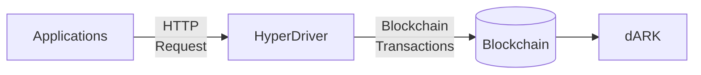
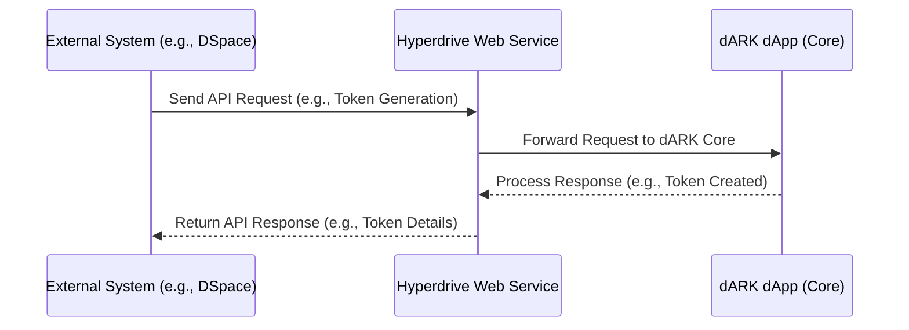

# Hyperdrive (dARK Minter)

- [Hyperdrive (dARK Minter)](#hyperdrive-dark-minter)
  - [How to Run](#how-to-run)
    - [System Requirements](#system-requirements)
    - [Manual](#manual)
    - [Docker execution](#docker-execution)
  - [HyperDriver Configuration](#hyperdriver-configuration)
  - [How to use the API](#how-to-use-the-api)


The Hyperdrive *is a Application Programming Interfaces (API)*, to provide seamless integration, data retrieval, and interaction within standard PID users (e.g., applications like dspace and ojs) and the dARK (Blockchain). 



> **Hyperdrive Goal:** Enable seamless adoption and integration of the dARK PID system, while promoting interoperability with multiple PID systems (e.g., like DOI (Digital Object Identifier) and ROR (Research Organization Registry)). To acomplish that goal we mapped the following **functionalities**:

1. Provide seamless interoperability between dARK and existing applications;
1. Encapsulate the Blockchain concepts;
1. [Reduce the comunication cost](./docs/hyperdrive_blueprint.md)
1. [Ensure that every transaction is executed properly executued and logged](./docs/hyperdrive_blueprint.md)


The **Hyperdrive** repository contains the source code for a web service designed to integrate the dARK dApp (core) with external systems such as DSpace and others. This service acts as a bridge, enabling other software to consume and utilize the functionalities provided by dARK.

In the following sequence diagram shows the interaction between a client, HyperDrive, and the dARK Blockchain. The client sends a request to HyperDrive, which converts the request to JSON-RPC and signs the transaction. HyperDrive then sends the transaction to the dARK Blockchain, which acknowledges the receipt of the transaction. The blockchain will process the transaction later. HyperDrive then responds to the client with a confirmation that the action will be processed.




The sequence diagram illustrates how the **Hyperdrive** web service facilitates communication between external systems (e.g., DSpace) and the dARK dApp (core). Here's a step-by-step explanation of the process:

1. **External System Request**: An external system, such as DSpace, sends an API request to the Hyperdrive web service. This request could be for operations like generating a dARK token.

2. **Request Forwarding**: Hyperdrive receives the request and forwards it to the dARK dApp (core) for processing. This ensures that the core functionalities of dARK are utilized.

3. **Response Processing**: The dARK core processes the request (e.g., creating a token) and sends the response back to Hyperdrive.

4. **Response Delivery**: Hyperdrive processes the response from the dARK core and returns it to the external system. This response could include details about the generated token or the result of the requested operation.

This flow demonstrates how Hyperdrive acts as a bridge, enabling seamless integration between external systems and the dARK ecosystem.

<!-- ## Overview

The primary purpose of this service is to provide a web API that facilitates the generation and assignment of dARK tokens (digital assets). This functionality, referred to as the **Minter**, is the core feature currently implemented in the application.

### Key Features

- **Integration**: Enables seamless communication between the dARK ecosystem and external systems.
- **Minter Service**: Automates the creation and assignment of dARK tokens, making it accessible via a web API. -->

## How to Run

Follow these simple steps to run the project:

### System Requirements

- Python 3.10
- pip
- Docker
- Docker Compose
- PostgreSQL 16

### Manual

**linux**
> ```
> $ cd hyperdrive
> $ pip install -r requirements
> $ cd app
> $ python api_server.py
> ```

**windows**
> ```
> cd hyperdrive
> pip install -r requirements
> cd app
> python.exe api_server.py
>```

### Docker execution

**build**
```
docker compose build
```

**run**
```
docker compose up -d
```


## HyperDriver Configuration

See the [HyperDrive configuration parameters detail](docs/configuration_parameter.md).

## How to use the API 

We provide example in how to use the API in the following [link](docs/how_to_use.md)