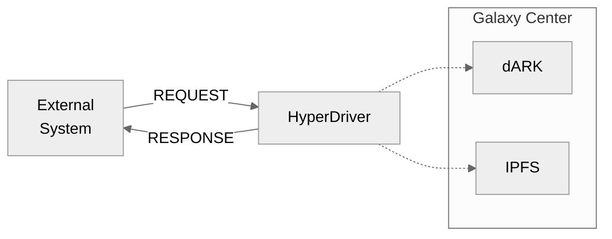
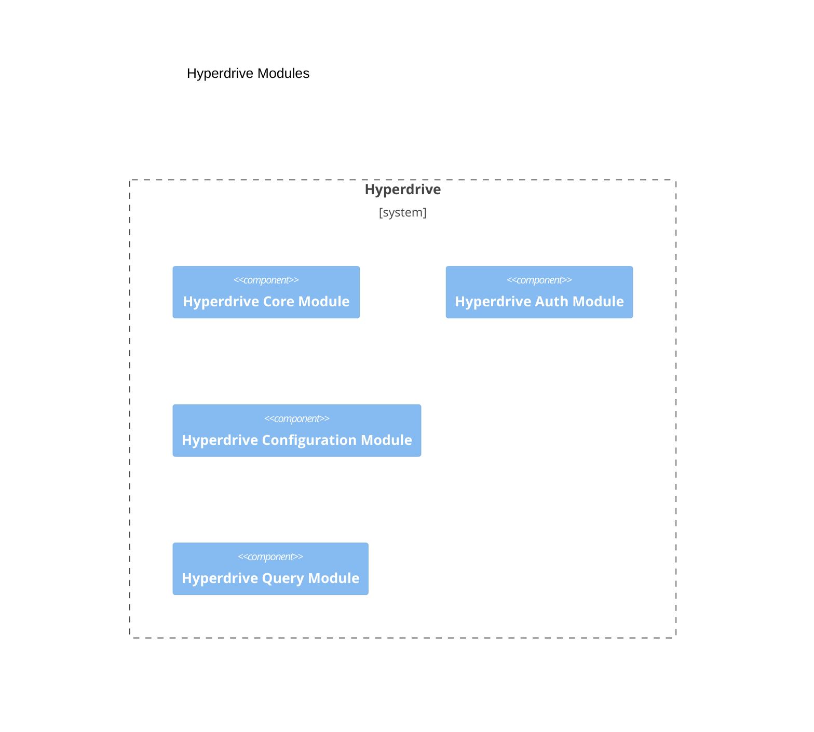
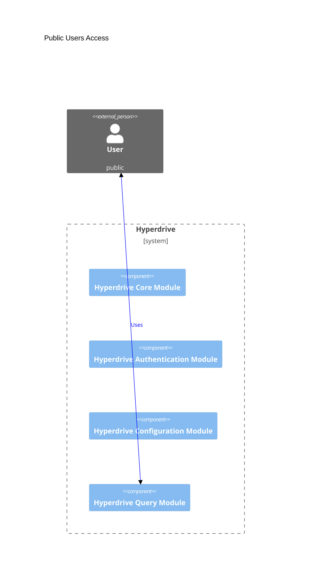
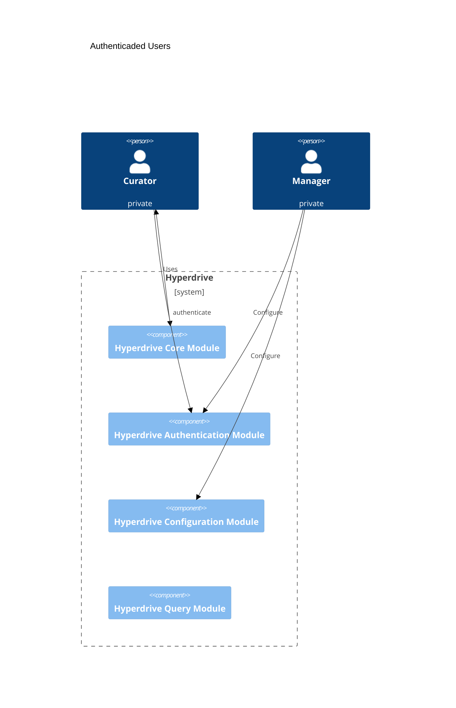

# Hyperdrive

dARK Hyperdrive repository 

## Hyperdrive overview



## Hyperdrive Modules

The hyperdrive module is organized into four modules, as the figure above presents.



Each module has its specific functionality:
1. Hyperdrive Core Moule: This module is responsible to performs PID registration operations (e.g., adding or updating PID metadata or requesting a new PID for a new item).
1. Hyperdrive Query Module: This module executes queries over the dARK metadata. 
1. Hyperdrive Authentication Module: This module authenticates and authorizes the users. Moreover, this module is responsible for converting and aligning the Hyperdrives users to the Blockchain users' accounts (also named wallets)
1. Hyperdrive Configuration Module: This module configures the Hyperdrive services. For example, create or disable SMA.

### Modules Details

The modules are further detailed in 

1. [Hyperdrive Core Moule](docs/core_module.md)
1. Hyperdrive Query Module
1. [Hyperdrive Authentication Module](docs/auth_module.md)
1. Hyperdrive Configuration Module

### Modules Use


The hyperdrive has three distinct users:

> 1. Public users: can execute (unauthenticated) queries over dARK metadata 
> 2. Curator users: can perform PID registration over a specific collection.
> 3. Manager user: configure the Hyperdrive system

The user interaction with the hyperdrive modules is depicted in the following. 


The public user can be a person or system (e.g., the DSpace software). Public users send the queries to the Hyperdrive Query Module, that process the request and return it to the users. The figure above illustrates the interaction mentioned above. 

The curator and manager users' actions are depicted above. 



Notice that the curator has access only to the Hyperdrive Authentication Module and Hyperdrive Core Module. In contrast, the manager has access only to the Hyperdrive Authentication Module and Hyperdrive Configuration Module.

## System requirements

- Python 3.8 or superior

<details>
<summary>Documentation requirements</summary>

We are employ the MARP over the VSCode with the folowing extensions

1. [Markdown Preview Enhanced](https://github.com/shd101wyy/vscode-markdown-preview-enhanced)
1. [Markdown Mermaid](https://github.com/mjbvz/vscode-markdown-mermaid)
1. [MARP](https://github.com/marp-team/marp-vscode)


### MARP

#### Windows

1. Install scoop https://scoop.sh/

```
> Set-ExecutionPolicy RemoteSigned -Scope CurrentUser # Optional: Needed to run a remote script the first time
> irm get.scoop.sh | iex
```

2. Install MARP
```
scoop install marp
```

3. Export Files


```
marp .\presentation.md --pdf
marp .\presentation.md --html
```

If inside visual studio code use the full path of marp comand

```
C:\Users\thiag\scoop\shims\marp.exe .\presentation.md --pdf
```

TODO: add system marp to code ps path
</details>

## Deploy Instructions

