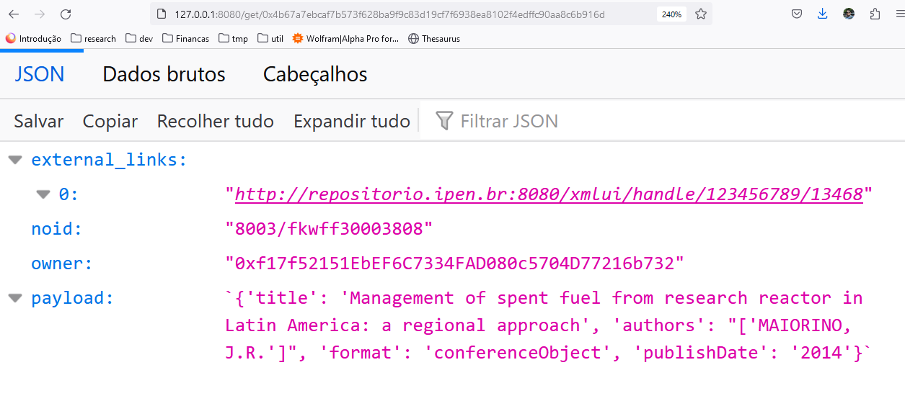

# Hyperdrive

dARK Hyperdrive repository 


## How to run

<details>
<summary>System Requirements</summary>
 - python 3.10
 - pip
 - docker
 - docker-compose
</details>

### Docker execution
```
docker compose up -d
```

### Manual

**linux**
> ```
> $ cd hyperdrive
> $ pip install -r requirements
> $ cd app
> $ python api_server.py
> ```

**windows**
> ```
> cd hyperdrive
> pip install -r requirements
> cd app
> python.exe api_server.py
>```

### Screenshots

**Hyperdrive Query**

