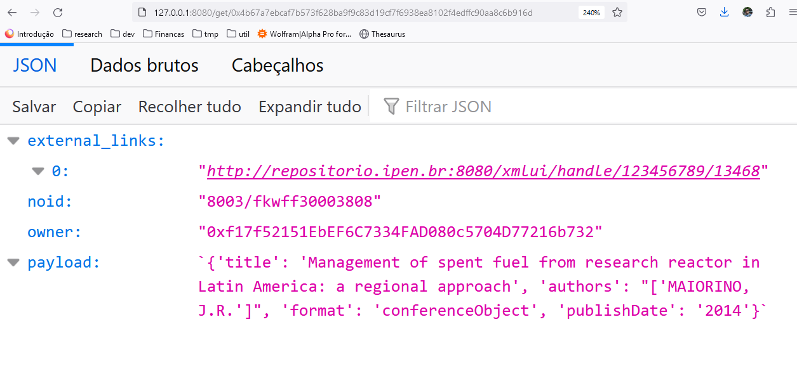

# Hyperdrive

dARK Hyperdrive repository 


## How to run

<details>
<summary>System Requirements</summary>
    <ul>
        <li> python 3.10 </li>
        <li> pip </li>
        <li> docker </li>
        <li> docker-compose </li>
    </ul>
</details>

### Docker execution

**build**
```
docker compose build
```

**run**
```
docker compose up -d
```

### Manual

**linux**
> ```
> $ cd hyperdrive
> $ pip install -r requirements
> $ cd app
> $ python api_server.py
> ```

**windows**
> ```
> cd hyperdrive
> pip install -r requirements
> cd app
> python.exe api_server.py
>```

### Screenshots

**Hyperdrive Query**

