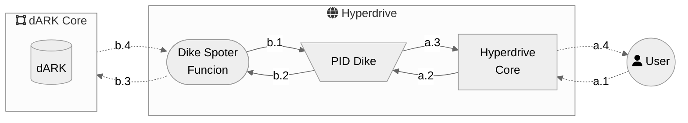

 # Hyperdrive Core Module

 Description 
 - problema da data deposito
	- a "data" de criacao do pid fica prejudicada
	- inserir um campo para isso?

## DESCRIPTION

TODO

### Pid Dike

The fastest consensus algorithm available to the hyper ledger besu (the Blockchain technology employed in the core dARK network)  has 400 transactions per second (TPS) as its maximum throughput. This throughput could be a problem in a network with numerous users. In other words, having more than 400 TPS will degrade the dARK response time and lead to a bad user experience. 

To mitigate the aforementioned problem, the **Hyperdrive must reduce its write operation to the dARK Core**. This restriction is applied only to the procedures that result in writing information on the Blockchain because read operations are distributed and indexed to answer as fast as possible, like a standard database system. Therefore, reading or querying functions do not impose any degradation on the dARK core.

In a PID system, like the ARK, one operation performed frequently is requesting an identifier for a new item (e.g., an article or dataset). Moreover, this operation can be performed in batches for a large number of items. For example, a curator could ask for identifiers for all undergraduates' completion work in a university, resulting in thousands of PID requests to the dARK Core. 

To reduce the number of requests to the dARK, the Hyperdrive must offer the possibility to the System Manager to configure a PID cache (Dike). 

The PID Dike keeps some unused PID in a Hyperdrive repository (lake). These PIDs will be assigned to new items when the curator asks, without the need to ask for the Blockchain. This will reduce the communication cost between the user and the dARK core. The figure above, in flow a, illustrates the PID Dike mechanism. 



Notice that the PID Dike is **optional and configured by the System Manager**. Moreover, the Hyperdrive **must have an asynchronous mechanism** (illustrated by Dike Spoter Function, in flow b) **to manage the number of PID in the Dike**.

The Dike Spoter Function must be aware of the load of the Blockchain to ask for new PIDs to be loaded in the Dike. _The awareness must be further modeled and documented_. 

## Hyperdrive Core API Methods


### PID Manipulation

The user must be authenticated to use this methods

- Assing PID: request a PID to the hyperdrive

description


#### Assing PID
<details>
 <summary><code>GET</code> <code><b>/core/pid//new</b></code> <code>(retrieve a new PID)</code></summary>

##### Parameters

> | name      |  type     | data type               | description                                                           |
> |----|---|---|---|
> | api_auth_key     |  required | str   | the api auth key  |

##### Responses

> | http code     | content-type                      | response                                                            |
> |----|---|---|
> | `200`         | `text/plain;charset=UTF-8`        | `{"pid":"8008/fk3abd1344"}`                                |
> | `400`         | `application/json`                | `{"code":"400","message":"Bad Request"}` |
> | `405`         | `text/html;charset=utf-8`         | None |

##### Example cURL

> ```javascript
>  curl -X GET -H "Content-Type: application/json" http://localhost:8889/core/pid/new
> ```

</details>

------------------------------------------------------------------------------------------

#### Set External PID
<details>
 <summary><code>PUT</code> <code><b>/core/pid//set_external_pid/{ark_id}</b></code> <code>(update a ark with an external PID)</code></summary>

##### Parameters

> | name      |  type     | data type               | description                                                           |
> |----|---|---|---|
> | api_auth_key     |  required | str   | the api auth key  |
> | ark_id       |  required | str   | the ark pid to be updated  |
> | external_pids |  required | str (json)   | the external pid  |
>
> The json of the external_pids should contain a list with all pids that will be added to the PID. For example:
>
>``` json 
> { external_pids : ["10.101.3.88.786"] }
> ```
> or
> ``` json 
> { external_pids : ["10.101.3.88.786","10.101.3.88.787","10.101.3.88.788"] }
> ```

##### Responses

> | http code     | content-type | response |
> |----|---|---|
> | `200`         | `text/plain;charset=UTF-8`        | `{"code":"200", "tx":["0xff67912abd"] }` or `{"code":"200", [ "tx":["0xff67912abd","0xff67912aba"] }`|
> | `400`         | `application/json`                | `{"code":"400","message":"Bad Request"}` |

##### Example cURL

> ```javascript
>  curl -X PUT -H "Content-Type: application/json" --data @put.json http://localhost:8889/core/pid//set_external_pid/'8008/fk3abc123'/
> ```

</details>

------------------------------------------------------------------------------------------

#### Set External link
<details>
 <summary><code>PUT</code> <code><b>/core/pid//set_external_link/{ark_id}</b></code> <code>(update a ark with an external link/url)</code></summary>

##### Parameters

> | name      |  type     | data type               | description                                                           |
> |----|---|---|---|
> | api_auth_key     |  required | str   | the api auth key  |
> | ark_id       |  required | str   | the ark pid to be updated  |
> | external_links |  required | str (json)   | the external links  |
>
> The json of the external_links should contain a list with all urls that will be added to the PID. Fro example:
>
>``` json 
> { external_links : ["www.google.com"] }
> ```
> or
> ``` json 
> { external_links : ["10.101.3.88.786","10.101.3.88.787","10.101.3.88.788"] }
> ```

##### Responses

> | http code     | content-type | response |
> |----|---|---|
> | `200`         | `text/plain;charset=UTF-8`        | `{"code":"200", "tx":["0xff67912abd"] }` or `{"code":"200", [ "tx":["0xff67912abd","0xff67912aba"] }`|
> | `400`         | `application/json`                | `{"code":"400","message":"Bad Request"}` |

##### Example cURL

> ```javascript
>  curl -X PUT -H "Content-Type: application/json" --data @put.json http://localhost:8889/core/pid//set_external_pid/'8008/fk3abc123'/
> ```

</details>

------------------------------------------------------------------------------------------

#### Set Payload
<details>
 <summary><code>PUT</code> <code><b>/core/pid//set_payload/{ark_id}</b></code> <code>(update a ark with an payload)</code></summary>

##### Parameters

> | name      |  type     | data type               | description                                                           |
> |----|---|---|---|
> | api_auth_key     |  required | str   | the api auth key  |
> | ark_id       |  required | str   | the ark pid to be updated  |
> | payload |  required | str  | payload  |
>
> **The payload format will be defined**

##### Responses

> | http code     | content-type | response |
> |----|---|---|
> | `200`         | `text/plain;charset=UTF-8`        | `{"code":"200", "tx":["0xff67912abd"] }` |
> | `400`         | `application/json`                | `{"code":"400","message":"Bad Request"}` |


##### Example cURL

> ```javascript
>  curl -X PUT -H "Content-Type: application/json" --data @put.json http://localhost:8889/core/pid//set_payload/'8008/fk3abc123'/
> ```

</details>

------------------------------------------------------------------------------------------

#### Configure PID
<details>
 <summary><code>PUT</code> <code><b>/core/pid//deploy/{ark_id}</b></code> <code>(update all ark field - e.g., external pids,links and payload)</code></summary>

##### Parameters

> | name      |  type     | data type               | description                                                           |
> |----|---|---|---|
> | api_auth_key     |  required | str   | the api auth key  |
> | ark_id       |  required | str   | the ark pid to be updated  |
> | external_pids |  optional | str (json)   | the external pids  |
> | external_links |  optional | str (json)   | the external links  |
> | payload |  required | str  | payload  |
>
> **The payload format will be defined**

##### Responses

> | http code     | content-type | response |
> |----|---|---|
> | `200`         | `text/plain;charset=UTF-8`        | `response_json` |
> | `400`         | `application/json`                | `{"code":"400","message":"Bad Request"}` |
>
> the response json
> ```json
> {"code":"200", 
>	"tx_urls": [],
>	"tx_links": [],
>	"tx_payload": ["0xff67912abd"]
>}
> ```
> notice that __tx_urls__ and __tx_urls__ can be empty or contains a list of transactions

##### Example cURL

> ```javascript
>  curl -X PUT -H "Content-Type: application/json" --data @put.json http://localhost:8889/core/pid//set_payload/'8008/fk3abc123'/
> ```

</details>

------------------------------------------------------------------------------------------

<!-- ## s -->
