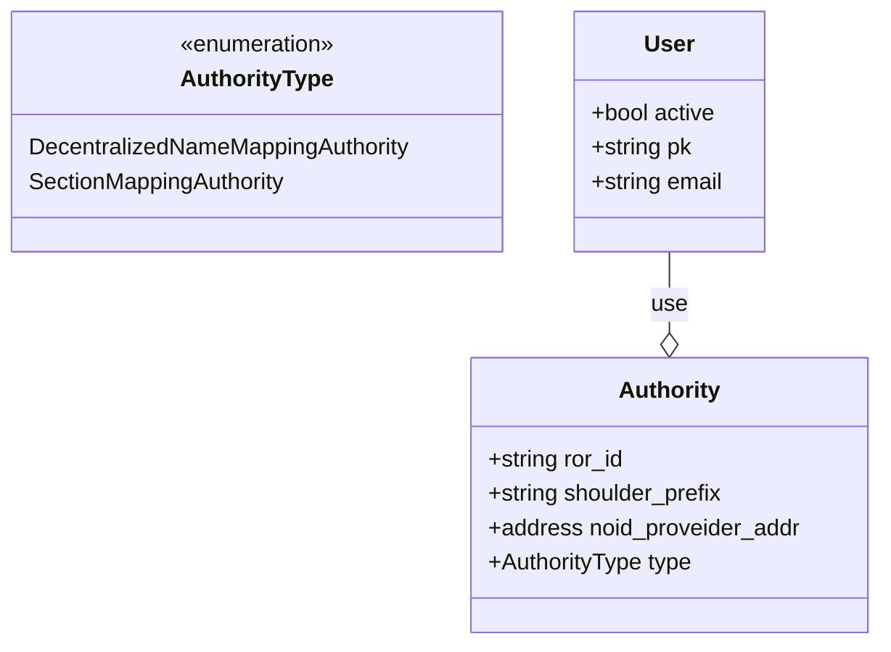

# HyperDrive AAA

## Entities


### User Methods

The user must be authenticated to use this methods

- [ADD](#adduser) : 
- DELETE
- UPDATE
- ENABLE
- DISABLE
- LIST
- SHOW

```
/admin/user/
```
#### ADD USER

<details>
 <summary><code>POST</code> <code><b>/admin/user/add </b></code> <code>(add a new user)</code></summary>

##### Parameters

> | name      |  type     | data type               | description                                                           |
> |----|---|---|---|
> | api_auth_key       |  required | str    | the api auth key    |
> | email              |  required | str    | user email          |
> | private_key        |  required | str    | user private key    |
> | authority_ror_id   |  required | str    | authority_ror_id    |

##### Responses

> | http code     | content-type       | response |
> |----|---|---|
> | `200`         | `application/json; charset=utf-8` | todo |
> | `40x`         | `application/json; charset=utf-8` | todo |
> | `50x`         | `application/json; charset=utf-8` | todo |

##### Validations

> | name      |  validation |
> |----|---|
> | email              |  must be valid e-mail             |
> | email              |  unique                           |
> | private_key        |  must be valid (todo)             |
> | authority_ror_id   |  must exists in local database    |


##### Example cURL [POST]

> ```javascript
>  curl -X POST http://localhost:8080/admin/user/add -H 'Content-Type: application/json' -d '{"email":"user@mail.com","private_key": "secret" , "authority_ror_id" : "8033" }'
> ```

</details>

#### DELETE USER

<details>
 <summary><code>POST</code> <code><b>/admin/user/delete </b></code> <code>(delete a user)</code></summary>

##### Parameters

> | name      |  type     | data type               | description                                                           |
> |----|---|---|---|
> | api_auth_key       |  required | str    | the api auth key    |
> | email              |  required | str    | user email          |

##### Responses

> | http code     | content-type       | response |
> |----|---|---|
> | `200`         | `application/json; charset=utf-8` | todo |
> | `40x`         | `application/json; charset=utf-8` | todo |
> | `50x`         | `application/json; charset=utf-8` | todo |

##### Example cURL [POST]

> ```javascript
>  curl -X POST http://localhost:8080/admin/user/delete -H 'Content-Type: application/json' -d '{"email":"user@mail.com"}'
> ```

</details>

#### UPDATE USER

<details>
 <summary><code>POST</code> <code><b>/admin/user/update </b></code> <code>(update user)</code></summary>

##### Parameters

> | name      |  type     | data type               | description                                                           |
> |----|---|---|---|
> | api_auth_key       |  required | str    | the api auth key    |
> | email              |  required | str    | user email          |
> | private_key        |  optional | str    | user private key    |
> | authority_ror_id   |  optional | str    | authority_ror_id    |

##### Responses

> | http code     | content-type       | response |
> |----|---|---|
> | `200`         | `application/json; charset=utf-8` | todo |
> | `40x`         | `application/json; charset=utf-8` | todo |
> | `50x`         | `application/json; charset=utf-8` | todo |

##### Validations

Same validations as [add](#adduser).

##### Example cURL [POST]

> ```javascript
>  curl -X POST http://localhost:8080/admin/user/add -H 'Content-Type: application/json' -d '{"email":"user@mail.com", "authority_ror_id" : "new_ror" }'
> ```

</details>

#### ENABLE USER

<details>
 <summary><code>POST</code> <code><b>/admin/user/enable </b></code> <code>(activated the user account)</code></summary>

##### Parameters

> | name      |  type     | data type               | description                                                           |
> |----|---|---|---|
> | api_auth_key       |  required | str    | the api auth key    |
> | email              |  required | str    | user email          |

##### Responses

> | http code     | content-type       | response |
> |----|---|---|
> | `200`         | `application/json; charset=utf-8` | todo |
> | `40x`         | `application/json; charset=utf-8` | todo |
> | `50x`         | `application/json; charset=utf-8` | todo |

##### Example cURL [POST]

> ```javascript
>  curl -X POST http://localhost:8080/admin/user/enable -H 'Content-Type: application/json' -d '{"email":"user@mail.com"}'
> ```

</details>

#### DISABLE USER

<details>
 <summary><code>POST</code> <code><b>/admin/user/disable </b></code> <code>(deactivate the user account)</code></summary>

##### Parameters

> | name      |  type     | data type               | description                                                           |
> |----|---|---|---|
> | api_auth_key       |  required | str    | the api auth key    |
> | email              |  required | str    | user email          |

##### Responses

> | http code     | content-type       | response |
> |----|---|---|
> | `200`         | `application/json; charset=utf-8` | todo |
> | `40x`         | `application/json; charset=utf-8` | todo |
> | `50x`         | `application/json; charset=utf-8` | todo |

##### Example cURL [POST]

> ```javascript
>  curl -X POST http://localhost:8080/admin/user/disable -H 'Content-Type: application/json' -d '{"email":"user@mail.com"}'
> ```
</details>

#### LIST USERS

todo

#### SHOW USER

todo

## Autority Methods
