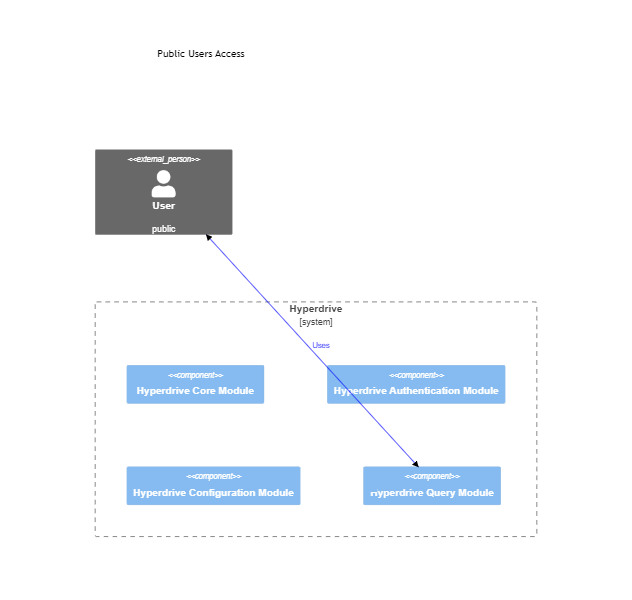
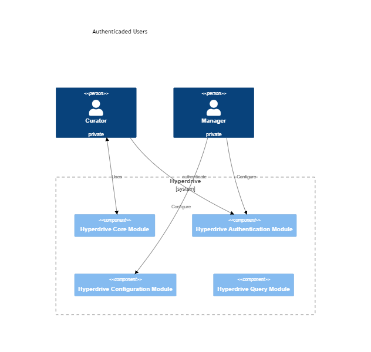

# Hyperdrive 

> Table of content:
> - [Hyperdrive transactions processing schema](#hyperdrive-transactions-processing-schema)
> - [Hyperdrive Functionalities](#hyperdrive-functionalities)
> - [Hyperdrive Modules Architetural Overview](#hyperdrive-module)

The Hyperdrive *is a Application Programming Interfaces (API)*, to provide seamless integration, data retrieval, and interaction within standard PID users (e.g., applications like dspace and ojs) and the dARK (Blockchain). 

> **Hyperdrive Goal:** Enable seamless adoption and integration of the dARK PID system, while promoting interoperability with multiple PID systems (e.g., like DOI (Digital Object Identifier) and ROR (Research Organization Registry)).

To acomplish that goal we mapped the following **functionalities**:

1. [Provide seamless interoperability between dARK and existing applications](#interoperability);
1. [Encapsulate](#blockchain-abstratction) the Blockchain concepts;
1. [Reduce the comunication cost](#pid-dike);
1. [Ensure that every transaction is executed properly executued and logged](#assync-blockchain-execution-and-verification)

## Hyperdrive transactions processing schema

In the following sequence diagram shows the interaction between a client, HyperDrive, and the dARK Blockchain. The client sends a request to HyperDrive, which converts the request to JSON-RPC and signs the transaction. HyperDrive then sends the transaction to the dARK Blockchain, which acknowledges the receipt of the transaction. The blockchain will process the transaction later. HyperDrive then responds to the client with a confirmation that the action will be processed.

Here is a more detailed explanation of the sequence of events:

> 1. The client sends a request to HyperDrive.
> 1. HyperDrive converts the request to JSON-RPC.
> 1. HyperDrive signs the transaction.
> 1. HyperDrive sends the transaction to the dARK Blockchain.
> 1. The dARK Blockchain acknowledges the receipt of the transaction.
> 1. The dARK Blockchain will process the transaction later.
> 1. HyperDrive responds to the client with a confirmation that the action will be processed.

This sequence diagram is a useful way to visualize the interaction between the client, HyperDrive, and the dARK Blockchain. It can be used to understand how the process works and to identify any potential bottlenecks or problems.

## Hyperdrive Functionalities

Functionalities description

### Interoperability

- Hyperdrive must enable communication and interaction between different components of the dRK (Web3 application) and standard web2 applications. The Hyperdrive could provide a tool for  developers to integrate various services, protocols, and platforms, facilitating interoperability and seamless data exchange.
- Hyperdrive must provide a standardized way to access blockchain data, such as retrieving account balances, transaction history, smart contract data, and blockchain events. Moreover, the Hyperdrive abstract the complexity of interacting directly with the blockchain and simplify data retrieval for developers.

### Blockchain Abstratction

- Hyperdrive must provide functionalities such as account creation, balance retrieval, transaction signing, and transaction broadcasting (Wallet Integration). Making it simple for developers to integrate the dARK to existing system, ensuring smooth user experiences when handling dARK funcionalities.
- Hyperdrive must facilitate the interaction with smart contracts (dARK methods) deployed on the blockchain. The Hyperdrive must provide methods to call functions, query data, and listen for events emitted by smart contracts. Hyperdrive abstract away the low-level details of interacting with smart contracts, making it easier for developers to build applications that interact with decentralized applications (dARK).

    
### Reduce the comunication cost (Pid Dike)

The fastest consensus algorithm available to the hyper ledger besu (the Blockchain technology employed in the core dARK network)  has 400 transactions per second (TPS) as its maximum throughput. This throughput could be a problem in a network with numerous users. In other words, having more than 400 TPS will degrade the dARK response time and lead to a bad user experience. 

To mitigate the aforementioned problem, the **Hyperdrive must reduce its write operation to the dARK Core**. This restriction is applied only to the procedures that result in writing information on the Blockchain because read operations are distributed and indexed to answer as fast as possible, like a standard database system. Therefore, reading or querying functions do not impose any degradation on the dARK core.

In a PID system, like the ARK, one operation performed frequently is requesting an identifier for a new item (e.g., an article or dataset). Moreover, this operation can be performed in batches for a large number of items. For example, a curator could ask for identifiers for all undergraduates' completion work in a university, resulting in thousands of PID requests to the dARK Core. 

To reduce the number of requests to the dARK, the Hyperdrive must offer the possibility to the System Manager to configure a PID cache (Dike). 

The PID Dike keeps some unused PID in a Hyperdrive repository (lake). These PIDs will be assigned to new items when the curator asks, without the need to ask for the Blockchain. This will reduce the communication cost between the user and the dARK core. The figure above, in flow a, illustrates the PID Dike mechanism. 

Notice that the PID Dike is **optional and configured by the System Manager**. Moreover, the Hyperdrive **must have an asynchronous mechanism** (illustrated by Dike Spoter Function, in flow b) **to manage the number of PID in the Dike**.

The Dike Spoter Function must be aware of the load of the Blockchain to ask for new PIDs to be loaded in the Dike. _The awareness must be further modeled and documented_. 

### Assync blockchain execution and verification

Blockchain transactions are typically executed in a decentralized manner, which means that transactions can be aborted, which means that they will not be reflected on the blockchain data. This means that the transaction will not be visible to other users, and it will not be able to be processed by the blockchain network. There are a number of reasons why a transaction might be aborted, such as; invalid data (if the data in the transaction is invalid, the transaction will be aborted), network congestion and insufficient funds.

To mitigate the native effects of a borted transattion, *the HyperDrive API can be used to check whether a blockchain transaction has been executed or not*. The following diagram shows how HyperDrive checks whether a transaction has been executed on the dARK Blockchain.

The HyperDrive should sotre the transaction that where request by each client (detailed in the first segment of diagram, Client Interaction). Before the transaction is requested the HyperDrive should start the transaction verification process.

The process starts with HyperDrive sending a message to the dARK Blockchain asking if the transaction has been executed (this method is encapsulated by the [dark-gateway](https://github.com/dark-pid/dark-gateway) lib). The dARK Blockchain then verifies the transaction and sends a message back to HyperDrive with the status of the transaction. 

If the transaction has been executed, HyperDrive marks the transaction as executed. If the transaction has not been executed, HyperDrive has two options: retry the transaction or notify the user. In the HyperDrive@RNP grant we will implement the notification. In summary, if a transaction faild the HyperDrive sends an email to the client notifying them that the transaction has failed.

## Hyperdrive Module

The hyperdrive module is organized into four modules, as the figure above presents.

Each module has its specific functionality:
1. Hyperdrive Core Moule: This module is responsible to performs PID registration operations (e.g., adding or updating PID metadata or requesting a new PID for a new item).
1. Hyperdrive Query Module: This module executes queries over the dARK metadata. 
1. Hyperdrive Authentication Module: This module authenticates and authorizes the users. Moreover, this module is responsible for converting and aligning the Hyperdrives users to the Blockchain users' accounts (also named wallets)
1. Hyperdrive Configuration Module: This module configures the Hyperdrive services. For example, create or disable SMA.

### Modules Details

TODO: The modules are further detailed in ... 

1. Hyperdrive Core Moule:
    - PID Resolution: Hyperdrive provide the means to resolve PIDs to their associated digital objects or resources. When a PID is accessed or queried, the Hyperdrive handles the resolution process, returning the relevant information or redirecting the user to the appropriate location. This enables seamless access to resources identified by PIDs, regardless of any underlying changes in storage locations or metadata.
    - PID Registration and Management: APIs allow users to register and manage PIDs programmatically. Through these APIs, applications can automate the process of assigning PIDs to digital objects, associating metadata with PIDs, updating or modifying PID records, and handling PID lifecycle events, such as deactivation or reassignment. This streamlines the management of PIDs and ensures their persistence and accuracy over time.
1. Hyperdrive Query Module (Not in fcope of RNP project):
    PID Metadata Retrieval: APIs enable the retrieval of metadata associated with PIDs. This metadata may include descriptive information about the digital object, such as title, author, date, or any other relevant attributes. By accessing this metadata programmatically through APIs, applications can enrich their functionality, provide context to users, and support advanced search and discovery features.
1. Hyperdrive Authentication Module
    - By leveraging Hyperdrive, applications can seamlessly interact with these infrastructure components, ensuring proper handling of requests, authentication, authorization, and adherence to PID-related standards and protocols.
    - TODO: ADD MORE INFO
1. Hyperdrive Configuration Module:
    - TODO: ADD MORE INFO

### User Interecations

The hyperdrive has three distinct users:

> 1. Public users: can execute (unauthenticated) queries over dARK metadata 
> 2. Curator users: can perform PID registration over a specific collection.
> 3. Manager user: configure the Hyperdrive system

The user interaction with the hyperdrive modules is depicted in the following. 

The public user can be a person or system (e.g., the DSpace software). Public users send the queries to the Hyperdrive Query Module, that process the request and return it to the users. The figure above illustrates the interaction mentioned above. 

The curator and manager users' actions are depicted above. 

Notice that the curator has access only to the Hyperdrive Authentication Module and Hyperdrive Core Module. In contrast, the manager has access only to the Hyperdrive Authentication Module and Hyperdrive Configuration Module.