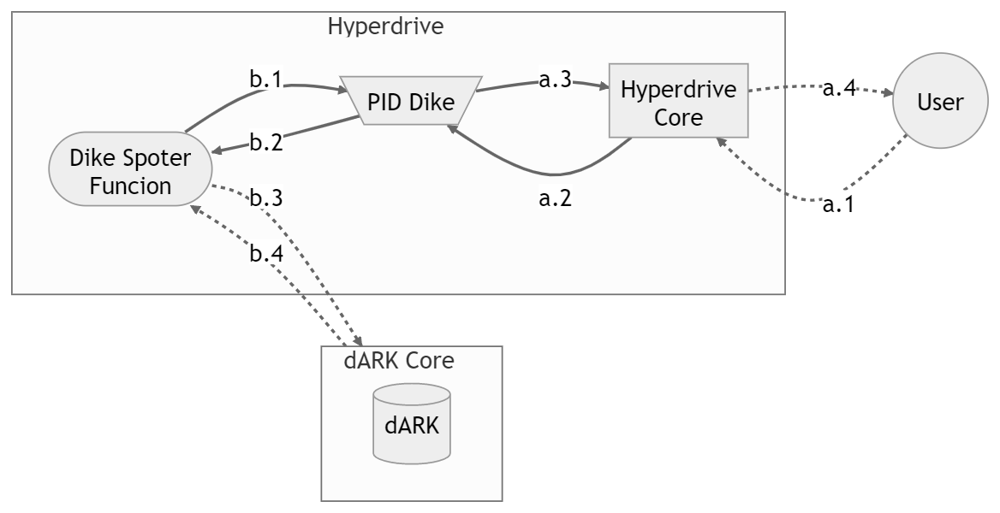

## Hyperdrive Funcionalities and Goals

The Hyperdrive *is a Application Programming Interfaces (API)*, to provide seamless integration, data retrieval, and interaction within standard PID users (e.g., applications like dspace and ojs) and the dARK (Blockchain). 

> **Hyperdrive Goal:** Enable seamless adoption and integration of the dARK PID system, while promoting interoperability with multiple PID systems (e.g., like DOI (Digital Object Identifier) and ROR (Research Organization Registry)).

To acomplish that goal we mapped the following **functionalities**:

1. Provide seamless [interoperability](#interoperability) between dARK and existing applications;
1. [Encapsulate](#blockchain-abstratction) the Blockchain concepts;
1. Reduce the [comunication cost](#pid-dike);

## Functionalities

Functionalities description

### Interoperability

- Hyperdrive must enable communication and interaction between different components of the dRK (Web3 application) and standard web2 applications. The Hyperdrive could provide a tool for  developers to integrate various services, protocols, and platforms, facilitating interoperability and seamless data exchange.
- Hyperdrive must provide a standardized way to access blockchain data, such as retrieving account balances, transaction history, smart contract data, and blockchain events. Moreover, the Hyperdrive abstract the complexity of interacting directly with the blockchain and simplify data retrieval for developers.

### Blockchain Abstratction

- Hyperdrive must provide functionalities such as account creation, balance retrieval, transaction signing, and transaction broadcasting (Wallet Integration). Making it simple for developers to integrate the dARK to existing system, ensuring smooth user experiences when handling dARK funcionalities.
- Hyperdrive must facilitate the interaction with smart contracts (dARK methods) deployed on the blockchain. The Hyperdrive must provide methods to call functions, query data, and listen for events emitted by smart contracts. Hyperdrive abstract away the low-level details of interacting with smart contracts, making it easier for developers to build applications that interact with decentralized applications (dARK).

    
### Reduce the comunication cost (Pid Dike)

The fastest consensus algorithm available to the hyper ledger besu (the Blockchain technology employed in the core dARK network)  has 400 transactions per second (TPS) as its maximum throughput. This throughput could be a problem in a network with numerous users. In other words, having more than 400 TPS will degrade the dARK response time and lead to a bad user experience. 

To mitigate the aforementioned problem, the **Hyperdrive must reduce its write operation to the dARK Core**. This restriction is applied only to the procedures that result in writing information on the Blockchain because read operations are distributed and indexed to answer as fast as possible, like a standard database system. Therefore, reading or querying functions do not impose any degradation on the dARK core.

In a PID system, like the ARK, one operation performed frequently is requesting an identifier for a new item (e.g., an article or dataset). Moreover, this operation can be performed in batches for a large number of items. For example, a curator could ask for identifiers for all undergraduates' completion work in a university, resulting in thousands of PID requests to the dARK Core. 

To reduce the number of requests to the dARK, the Hyperdrive must offer the possibility to the System Manager to configure a PID cache (Dike). 

The PID Dike keeps some unused PID in a Hyperdrive repository (lake). These PIDs will be assigned to new items when the curator asks, without the need to ask for the Blockchain. This will reduce the communication cost between the user and the dARK core. The figure above, in flow a, illustrates the PID Dike mechanism. 

Notice that the PID Dike is **optional and configured by the System Manager**. Moreover, the Hyperdrive **must have an asynchronous mechanism** (illustrated by Dike Spoter Function, in flow b) **to manage the number of PID in the Dike**.

The Dike Spoter Function must be aware of the load of the Blockchain to ask for new PIDs to be loaded in the Dike. _The awareness must be further modeled and documented_. 