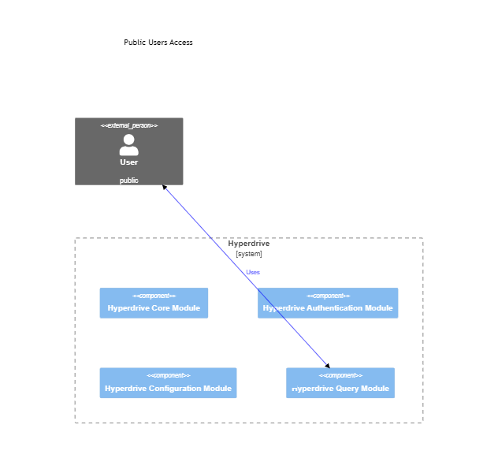
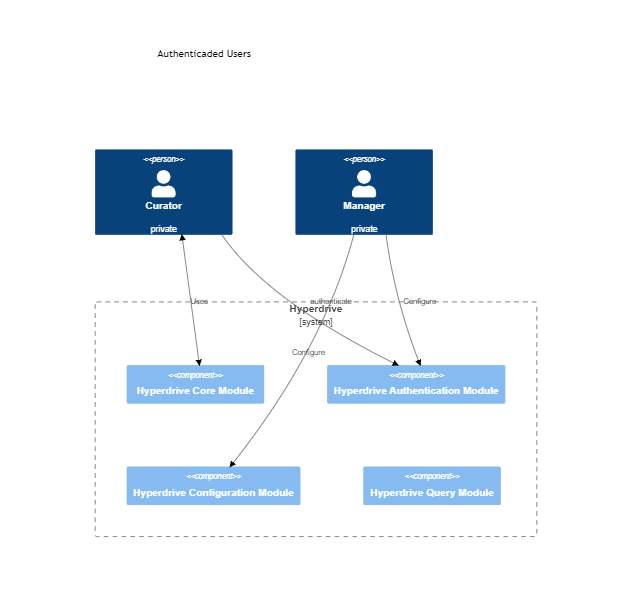

The hyperdrive has three distinct users:

> 1. Public users: can execute (unauthenticated) queries over dARK metadata 
> 2. Curator users: can perform PID registration over a specific collection.
> 3. Manager user: configure the Hyperdrive system

The user interaction with the hyperdrive modules is depicted in the following. 

The public user can be a person or system (e.g., the DSpace software). Public users send the queries to the Hyperdrive Query Module, that process the request and return it to the users. The figure above illustrates the interaction mentioned above. 

The curator and manager users' actions are depicted above. 

Notice that the curator has access only to the Hyperdrive Authentication Module and Hyperdrive Core Module. In contrast, the manager has access only to the Hyperdrive Authentication Module and Hyperdrive Configuration Module.